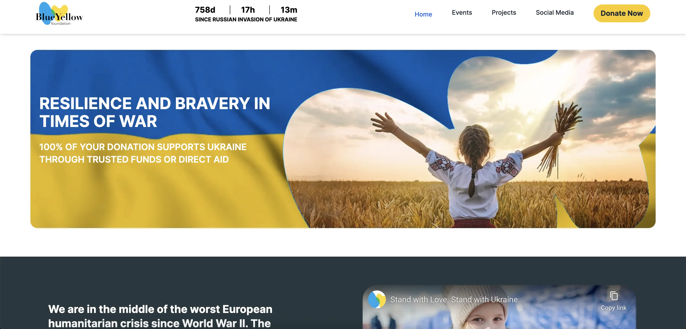
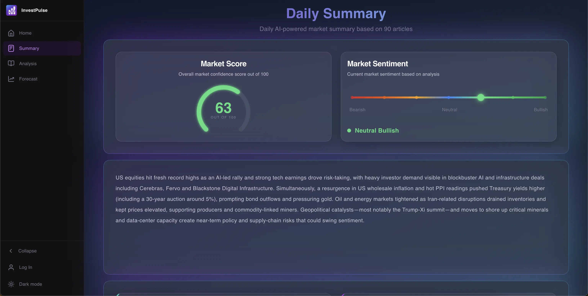
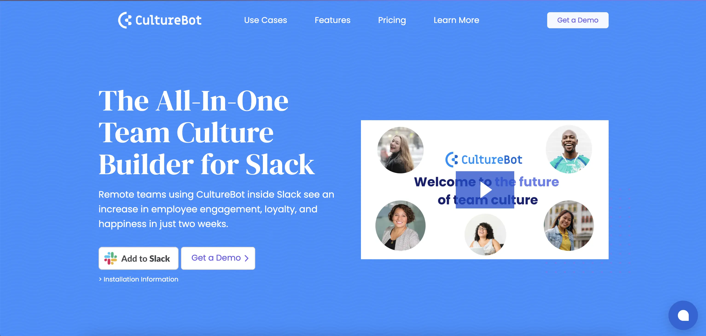
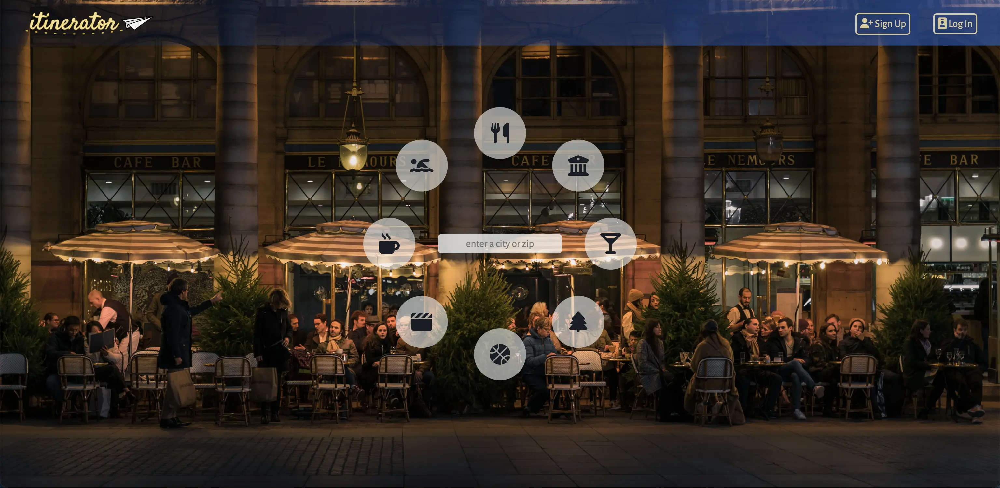
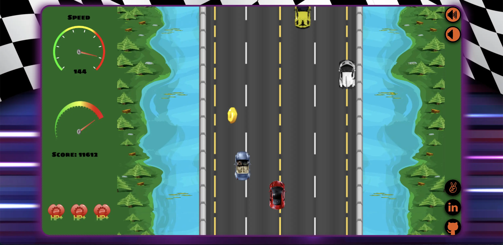

# Anton James — Senior Software Engineer

Source for my portfolio site, live at **[antonjames.dev](https://antonjames.dev/)**.

A static site — no framework, no bundler for the page itself — served straight from this repo by GitHub Pages. See [Development](#development) if you're working on it.

## About Me

Senior Software Engineer with 4+ years building production web applications for data-heavy enterprise products. I specialize in frontend architecture, design systems, and component libraries, with full-stack experience across APIs, data layers, and deployment.

After a Master's in Computer Science and Mathematics, I spent two years teaching CS — the best possible training for the work I do now. Breaking down recursion for beginners every week shaped how I approach engineering: clear abstractions, predictable systems, and code the next person can actually understand. I later went through App Academy, where roughly 3% of applicants are accepted.

These days I'm most interested in frontend architecture and design systems at scale — the kind of work where decisions on Monday compound across dozens of engineers and hundreds of components over the next year.

**Core stack:** TypeScript · React · Next.js · Node.js · GraphQL · PostgreSQL

## Featured Work

### Enterprise Platforms at Scale

- Led a zero-downtime migration of 900+ components to a modern React/MUI architecture, establishing migration patterns adopted as team standard.
- Designed and shipped an internal design system (81 components, adopted by 4 product teams) with multi-layer design tokens supporting theming and accessibility.
- Architected the frontend for a real-time threat analytics platform serving dozens of enterprise customers using React, TypeScript, and GraphQL.
- Built the frontend for an internal AI-powered monitoring tool with a chat interface and CRUD dashboard, partnering on API design.
- Contributed features and performance fixes to open-source data visualization libraries (ReaViz, ReaGraph, ReaBlocks).
- Optimized a Next.js marketing site with SSR and Framer Motion, improving Core Web Vitals and driving a 19% increase in unique traffic.

### Blue & Yellow — Non-profit Donations Portal

- Led development and deployment of a donation and fundraising platform in React, Next.js, and Tailwind CSS.
- Cut load time from 4.11s to 2.13s with Next.js SSR, improving SEO alongside it.
- Designed and implemented REST endpoints for full CRUD, improving backend reliability and data consistency.
- Optimized storage and retrieval in PostgreSQL, reducing load times and external API costs.

[Live](https://blueyellowfoundation.org/)

### Invest Pulse — Stock Market Tracking App

- Designed a token-based design system unifying Tailwind CSS and MUI, reducing styling inconsistencies across the app.
- Integrated OpenAI APIs into core product workflows for AI-driven insights.
- Implemented interactive financial charts via the TradingView API with real-time data rendering.
- Deployed on Vercel with environment-based deployments and CI/CD.

[Live](https://investpulse.vercel.app/)

### CultureBot — Employee Engagement App

- Integrated an AI conversational layer using Python and the OpenAI API for contextual responses across the platform.
- Automated content extraction and preprocessing with BeautifulSoup for consistent data delivery.

[Live](https://getculturebot.com/)

### Itenerator — Personalized Activity Recommender

- Implemented Redux for centralized state, increasing loading speed 40% and reducing DB and Google API calls.
- Built RESTful APIs with Express.js to connect frontend and backend.
- Used Mongoose to streamline Node.js–MongoDB communication.

[Live](https://excursionexplorer.onrender.com/) · [Repo](https://github.com/dtannyc1/itinerator/)

### Torque — Fast-paced Racing Game

- Crafted custom game physics and gameplay in vanilla JavaScript.
- Used the Canvas API for smooth visual effects.
- Applied OOP principles for code efficiency and scalability.

[Live](https://antonjames-sistence.github.io/Torque/) · [Repo](https://github.com/AntonJames-Sistence/Torque/)

## Skills

**Languages** — JavaScript, TypeScript, Python, Ruby, HTML/CSS, SQL 
**Frontend** — React, Next.js, Redux, Tailwind CSS, MUI, design systems, component libraries 
**Backend** — Node.js, Express.js, Ruby on Rails, REST, GraphQL 
**Data** — PostgreSQL, MongoDB 
**Other** — AWS, Git, three.js, OpenAI APIs, algorithms & data structures 

## Contact

[LinkedIn](https://www.linkedin.com/in/anton-james-ja/) · [GitHub](https://github.com/AntonJames-Sistence/) · [antonjames.dev](https://antonjames.dev/)

Thanks for visiting! 😊
